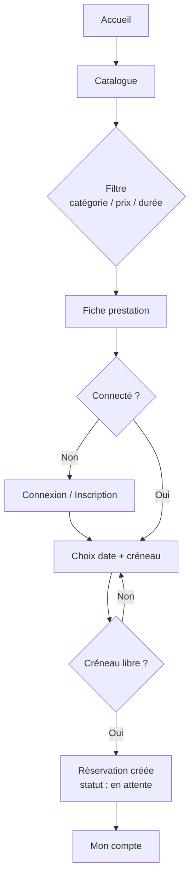
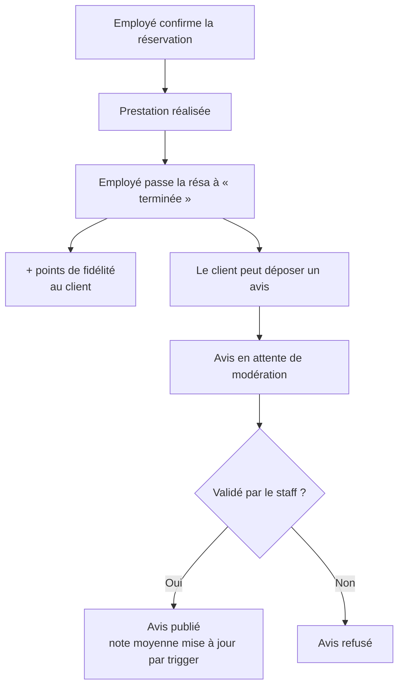
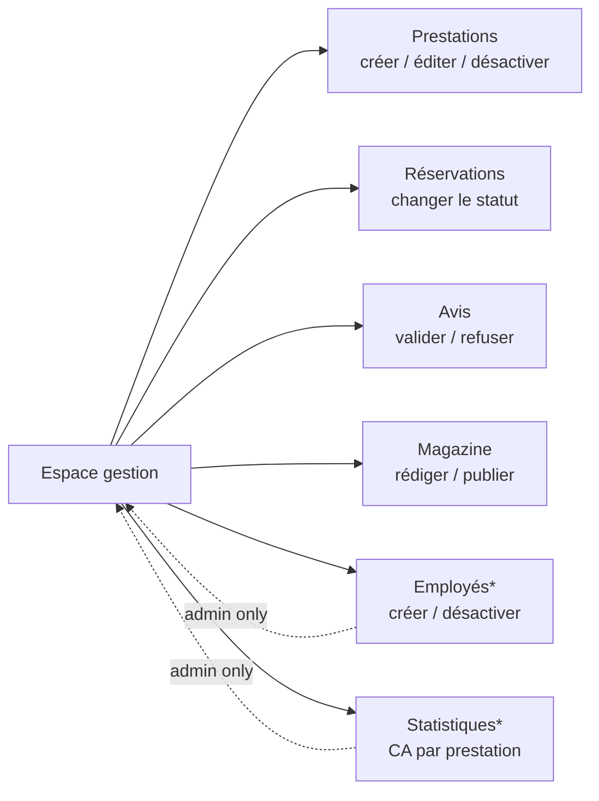

# Maquettage — ZenSpace

> Dossier de conception (CP2 « Maquetter une application ») : charte graphique,
> wireframes des pages clés et parcours utilisateurs. Il documente les choix de
> conception **en amont** de l'intégration ; la traduction en code est décrite
> dans [`DESIGN.md`](DESIGN.md) (système de composants effectivement implémenté).

Sommaire :
1. [Intentions & contraintes](#1-intentions--contraintes)
2. [Charte graphique](#2-charte-graphique)
3. [Wireframes des pages clés](#3-wireframes-des-pages-clés)
4. [Parcours utilisateurs](#4-parcours-utilisateurs)
5. [Approche responsive & accessibilité](#5-approche-responsive--accessibilité)

---

## 1. Intentions & contraintes

**Positionnement** : institut de bien-être à Bordeaux. L'interface doit évoquer
le calme et la confiance, tout en restant un **site de services** clair et
orienté **réservation** (et non une revue éditoriale).

**Parti pris visuel** : **spa de luxe sombre & or** — thème sombre (vert-nuit),
accent doré, grande typographie **serif** (Cormorant Garamond) pour les titres et
sans-serif (Inter) pour l'interface. Héros dramatique plein cadre, détails dorés
(filets, puces, badges de prix), marque affirmée (barre utilitaire, pastille de
marque, bouton « Réserver » toujours visible). Ambiance boutique-hôtel haut de
gamme, orientée réservation — l'opposé d'un template générique.

**Contraintes** :
- **Mobile-first** : conception pensée d'abord pour le téléphone, puis élargie.
- **Accessibilité RGAA AA** : contrastes vérifiés, navigation clavier, `prefers-reduced-motion`.
- **Amélioration progressive** : tout fonctionne sans JavaScript ; le JS enrichit.

**Personas** (résumé) :
| Persona | Objectif principal | Pages prioritaires |
|---|---|---|
| Cliente visiteuse | Trouver et réserver un soin | Accueil → Catalogue → Fiche → Réservation |
| Cliente fidèle | Suivre ses réservations et ses points | Connexion → Mon compte |
| Employé / Admin | Gérer prestations, réservations, avis, magazine | Espace gestion |

---

## 2. Charte graphique

### 2.1 Palette

| Rôle | Nom | Hex | Usage | Contraste |
|---|---|---|---|---|
| Fond | Vert-nuit | `#0F1713` | Fond de page | — |
| Surface | Sombre | `#16221B` | En-tête, cartes | — |
| Surface alt. | Sombre surélevé | `#1C2C23` | Bandes de section | — |
| Texte | Crème | `#ECE6D8` | Texte principal | ~13:1 sur le fond ✅ |
| Texte secondaire | Sauge grisé | `#9DA99F` | Légendes, méta | ~5:1 sur le fond ✅ |
| Filet | Crème 13 % | `rgba(236,230,216,.13)` | Bordures discrètes | — |
| Accent | Or | `#C9A227` | Liens, boutons, détails | ~7:1 sur le fond ✅ |
| Accent foncé | Or profond | `#A9861A` | Survols, dégradés | — |
| Sur l'or | Encre | `#14201A` | Texte posé SUR l'or (boutons) | ~8:1 sur l'or ✅ |

Thème sombre : texte crème sur fond vert-nuit (fort contraste). L'or signale
l'action et les détails de luxe ; le texte posé sur l'or est en encre foncée
(jamais blanc) pour respecter WCAG AA.

### 2.2 Typographie

| Usage | Police | Graisses | Remarque |
|---|---|---|---|
| Titres | **Cormorant Garamond** (serif) | 500 / 600 | Grand, élégant, « luxe » |
| Interface / texte | **Inter** (sans-serif) | 400–700 | Lisibilité écran, UI |

Contraste fort entre un serif de luxe (titres, immenses) et un sans-serif net
(interface). Échelle de titres fluide via `clamp()` : `h1` ~2.6 → 4.2 rem
(héros jusqu'à ~5 rem) · `h2` ~2 → 3 rem · `h3` 1.45 rem. Corps 1 rem, interligne 1.6.

### 2.3 Échelle d'espacement & géométrie (design tokens)

- **Espacement** : `--space-1..8` = 0.25 / 0.5 / 0.75 / 1 / 1.5 / 2 / 3 / 4.5 rem.
- **Rayons** : `--radius` 10px (base), `--radius-sm` 6px, `--radius-lg` 18px, pilule 999px.
- **Ombres** : `--shadow-sm / md / lg` (élévation croissante, douce).
- **Mouvement** : `--dur` 220ms, courbe `cubic-bezier(.22,.61,.36,1)`.

### 2.4 Iconographie & logo

- **Icônes** : jeu SVG *inline* (aucune dépendance externe), trait fin 1.6,
  `currentColor` (héritent la couleur du texte). Cf. `Views/partials/icons.php`.
- **Logo / wordmark** : une pastille carrée à coins arrondis portant l'initiale
  « Z » (fond **or**, encre foncée) accolée au nom « ZenSpace » en serif — repère
  de marque simple, présent en en-tête et en pied de page.

### 2.5 Inventaire des composants

- **Boutons** : `primaire` (fond accent), `fantôme` (contour), `danger` (action
  destructive) ; états survol (léger soulèvement + ombre), actif, désactivé.
- **Cartes de prestation** : image (ratio 4:3) + corps (catégorie, titre lien,
  note en étoiles, durée) et un pied **prix + bouton « Réserver »** ; élévation
  au survol + léger zoom de l'image.
- **Formulaires** : label au-dessus, focus clavier visible, erreurs signalées par
  couleur **et** contour + message lié (`aria-describedby`).
- **Badges de statut** : pilules colorées (en attente / confirmée / terminée / annulée).
- **Panneau fidélité** : solde + palier (bronze/argent/or) + historique des points.
- **Bandes** : sections pleine largeur à fond sable pour rythmer la page.

---

## 3. Wireframes des pages clés

Wireframes basse fidélité (zoning) — la hiérarchie et les blocs, sans le style.

### 3.1 Accueil

```
┌──────────────────────────────────────────────┐
│ ☎ 05 56… · Lun–Ven 9h–18h        1 rue du Spa │  barre utilitaire
├──────────────────────────────────────────────┤
│ [Z] ZenSpace   Accueil Prestations Contact   Connexion [Réserver] │  en-tête sticky
├──────────────────────────────────────────────┤
│  HÉRO deux colonnes                            │
│  Kicker · Titre · Sous-titre        │  [photo] │
│  [Voir les prestations] [Contact]   │          │
│  ✓ diplômés ✓ en ligne ✓ fidélité   │          │
├──────────────────────────────────────────────┤
│  NOS PRESTATIONS PHARES        « tout le cat.» │  ← services en premier
│  [carte] [carte] [carte]                       │
│   image · cat · titre · ★ · durée              │
│   ─────────────  prix   [Réserver]             │
├──────────────────────────────────────────────┤
│  NOS ENGAGEMENTS (bande) [icône]×3             │
├──────────────────────────────────────────────┤
│  COMMENT ÇA SE PASSE   1—2—3—4 étapes          │
├──────────────────────────────────────────────┤
│  AVIS (bande)  [citation ★★★★★] …               │
├──────────────────────────────────────────────┤
│  CONSEILS BIEN-ÊTRE (magazine, secondaire)     │  ← relégué en bas
│  [lien article] [lien article] [lien article]  │
├──────────────────────────────────────────────┤
│  BANDE CTA verte : « Prêt·e ? » [Réserver]     │
├──────────────────────────────────────────────┤
│  PIED SOMBRE : marque | coord. | horaires | liens │
└──────────────────────────────────────────────┘
```

### 3.2 Catalogue des prestations

```
┌──────────────────────────────────────────────┐
│  Nos prestations                               │
│  Filtres :  [Catégorie ▾]  Prix ≤ [====]  Durée ≤ [===] │  (GET, amélioré en JS)
├──────────────────────────────────────────────┤
│  Grille de cartes (responsive auto-fill)       │
│  [img]        [img]        [img]               │
│  catégorie    catégorie    catégorie           │
│  Titre        Titre        Titre               │
│  ★ note       ★ note       ★ note              │
│  durée · prix durée · prix durée · prix        │
└──────────────────────────────────────────────┘
```
Sans JS : la soumission GET recharge la page filtrée (URL partageable).
Avec JS : `fetch` met à jour la grille sans rechargement.

### 3.3 Fiche prestation + planning

```
┌──────────────────────────────────────────────┐
│  [Bannière photo 16:7]                         │
│  Catégorie · Titre serif · durée · PRIX        │
│  Description…                                  │
│  [Réserver]  [Retour au catalogue]             │
├──────────────────────────────────────────────┤
│  PROCHAINES DISPONIBILITÉS (7 jours)           │
│  Jour1  Jour2  Jour3 …                          │
│  09:00  09:00  —                               │  créneaux : libre (cliquable)
│  10:30  10:30  10:30                           │           réservé/passé (grisé)
│  …                                             │
├──────────────────────────────────────────────┤
│  AVIS CLIENTS  ★ moyenne (N)                    │
│  [citation] [citation] …                       │
└──────────────────────────────────────────────┘
```

### 3.4 Tunnel de réservation

```
Fiche ──[Réserver]──▶ ┌───────────────────────┐
                      │ Formulaire réservation │
                      │  Prestation (rappel)   │
                      │  Date  [____]          │
                      │  Créneau ( ) 09:00 …   │
                      │  [Confirmer]           │
                      └───────────┬────────────┘
                                  ▼
                      Récapitulatif « Mon compte »
                      (réservation en attente)
```

### 3.5 Espace de gestion (back-office)

```
┌───────────┬──────────────────────────────────┐
│ GESTION   │  Titre de la section    [+ Créer] │
│ Tableau   │  ┌──────────────────────────────┐ │
│ Prestations│  │ Tableau de données           │ │
│ Réservations│ │  ligne … [Modifier][Suppr.]  │ │
│ Avis      │  │  …                            │ │
│ Magazine  │  └──────────────────────────────┘ │
│ Employés* │                                    │
│ Stats*    │  (* = admin uniquement)            │
└───────────┴──────────────────────────────────┘
```

---

## 4. Parcours utilisateurs

### 4.1 Visiteuse → réservation



### 4.2 Cliente → avis & fidélité



### 4.3 Administrateur → gestion



---

## 5. Approche responsive & accessibilité

**Mobile-first** : la conception part de l'écran ~375 px (une colonne, navigation
compacte) puis s'élargit. Les grilles utilisent `auto-fill/minmax` (elles
reflowent naturellement) et les titres `clamp()` (taille fluide). Points de
rupture principaux : ~768 px (empilement des blocs) et ~860 px (sidebar de
gestion → pleine largeur).

**Accessibilité** (RGAA AA) :
- Contrastes vérifiés (cf. §2.1) ; couleur jamais seul vecteur d'information.
- Focus clavier visible partout (`:focus-visible`), lien d'évitement, points de
  repère ARIA (`nav`, `main`, `role="status/alert"` pour les messages).
- Alternatives textuelles sur les images de contenu ; images décoratives `alt=""`.
- `prefers-reduced-motion` : toutes les animations d'apparition et transitions
  sont neutralisées ; le contenu reste évidemment visible sans JavaScript.
